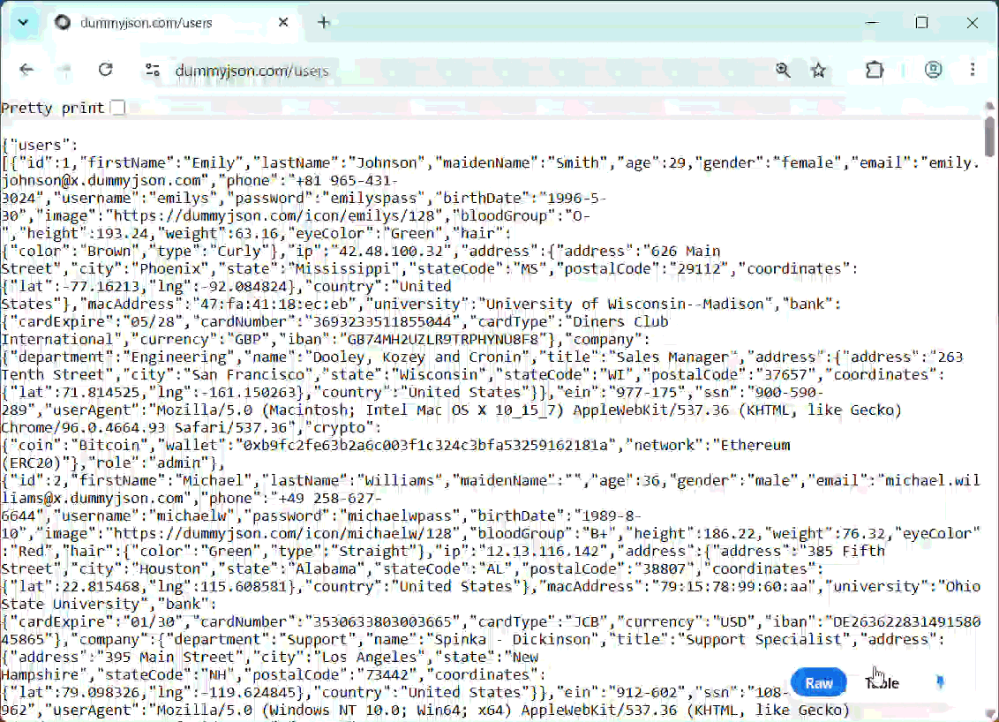
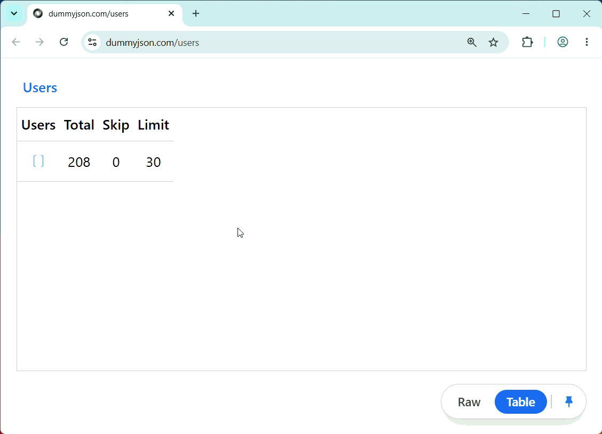
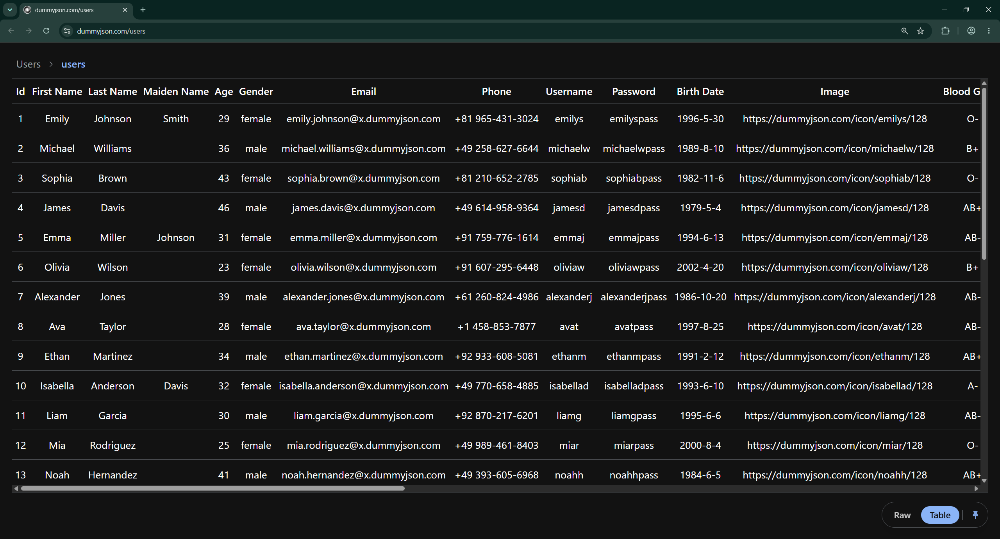

# JSON Preview

Chrome and Chromium browser extension that previews JSON documents as a Table, powered by [JSOC Grid](https://github.com/jsoc-dev/grid) and [TanStack Table](https://tanstack.com/table/latest).

When navigating to any JSON URL or API endpoint in your browser, JSON Preview extension detects the JSON document and presents a toggle to switch between the raw JSON view and the table view.

## Installation

1. Download the latest release archive (`.zip`) from [GitHub Releases](https://github.com/jsoc-dev/grid/releases?q=browser-json-preview).

2. Extract the downloaded `.zip` file to a folder on your machine.

3. Open Chrome and navigate to [chrome://extensions/](chrome://extensions/)

4. Enable **Developer mode** using the toggle in the top right.

5. Click **Load unpacked** in the top left.

6. Select the extracted folder.

## Features

- **Toggle View Mode:** Seamlessly switch between the raw JSON document and the table view using the floating toggle button.

  

- **Nested Navigation:** Drill into nested objects and arrays using interactive breadcrumbs, and easily navigate back up the data hierarchy.

  

- **Default View Preference:** Pin your preferred default view mode (Grid or Raw JSON) so subsequent JSON documents open in your preferred format automatically.

  

- **Dark Mode:** Automatically adapts to the browser's dark mode setting.

  

## Limitations

- **Invalid Rows:** Since the underlying grid engine requires row data to be objects, arrays containing only primitive values (e.g., ["apple", "banana"] or [1, 2, 3]) are considered invalid and will not be displayed in the table.

## Installation for developers

1. Clone the [jsoc/grid](https://github.com/jsoc-dev/grid) repository.

2. Install dependencies from the monorepo root:

   ```bash
   pnpm install
   ```

3. Run the dev server:

   ```bash
   pnpm --filter browser-json-preview dev
   ```

4. Load the unpacked extension in Chrome:
   - Open Chrome and navigate to [chrome://extensions/](chrome://extensions/)
   - Enable **Developer mode** using the toggle in the top right.
   - Click **Load unpacked** in the top left.
   - Select the `apps/browser-json-preview/dist` folder.

5. As you make code changes, CRXJS will automatically rebuild and reload the extension.

## License

MIT
