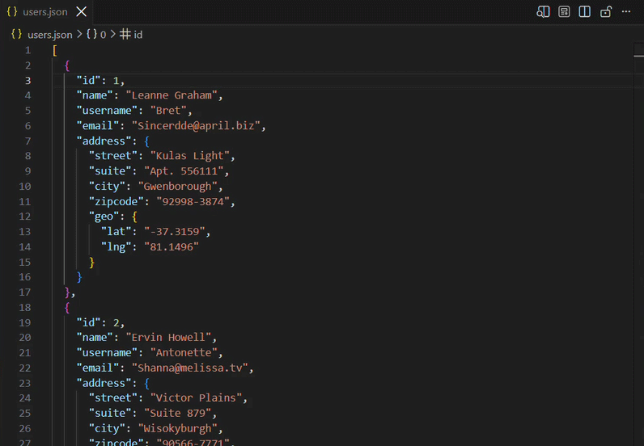
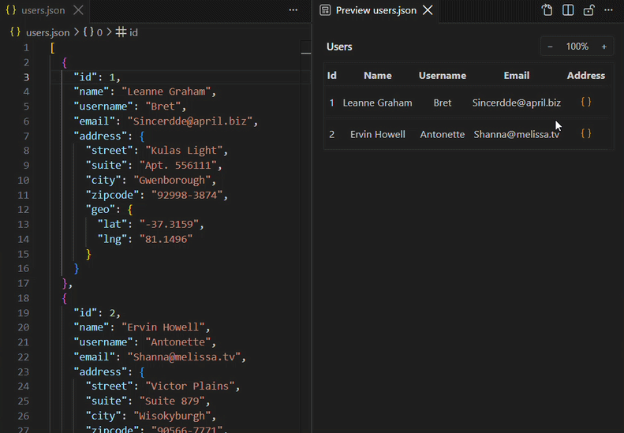
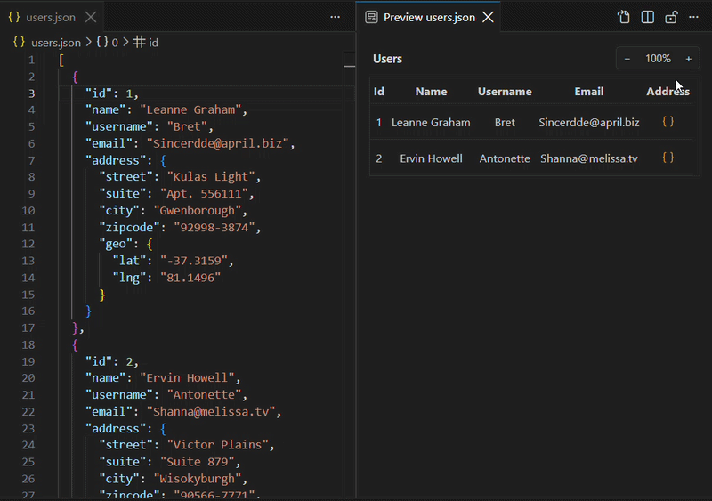
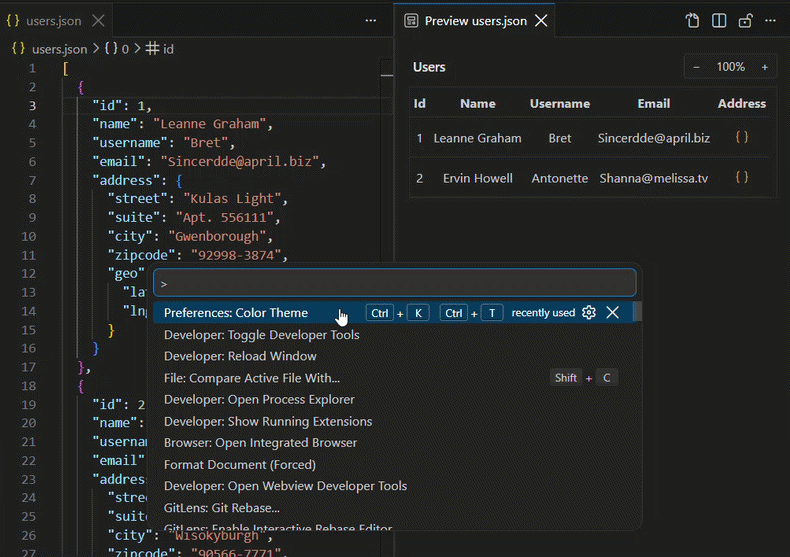

# JSON Preview

VS Code extension that previews JSON and JSONC files as a read-only table, powered by [JSOC Grid](https://github.com/jsoc-dev/grid).

## Usage

1. Open a JSON or JSONC file.
2. Click **Open Preview to the Side** in the editor title bar, or run **JSON Preview: Open Preview to the Side** from the Command Palette (`Ctrl+Shift+P` / `Cmd+Shift+P`).
3. A preview panel opens beside the editor and updates as you edit.

## Features

- **Tabular View:** View JSON/JSONC arrays and objects as clean, read-only tables.

  
- **Nested Navigation:** Easily navigate into nested objects and arrays using interactive breadcrumbs.

  
- **Zoom Controls:** Zoom in and out of the table independently of your workspace font size via dedicated UI controls or using mouse wheel with CTRL pressed.

  
- **Inherited Theming:** The preview inherits the theme from the VS Code editor. Seamlessly matches your currently active color theme.

  

## Limitations

- **Invalid Rows:** Since the underlying grid requires row data to be objects, if you provide an array containing primitive values (e.g., ["apple", "banana"] or [1, 2, 3]), these non-object rows will be ignored and not displayed in the table.

## Development

This extension lives in the [jsoc/grid](https://github.com/jsoc-dev/grid) monorepo at `apps/vscode-json-preview`. Clone the repo, then from the monorepo root run `pnpm install`.

### Live debugging

Open the monorepo in VS Code and press **F5** (launch configuration: **vscode-json-preview**). That starts esbuild in watch mode and opens an **Extension Development Host** — a second VS Code window with the extension loaded, where you can set breakpoints and test changes as you edit.

### Run locally

To try the extension in your regular VS Code (without the debug host), build a `.vsix` and install it:

```bash
pnpm --filter json-preview package
pnpm --filter json-preview install-local code
```

Use `code`, `cursor`, `code-insiders`, `antigravity-ide` or any editor CLI that supports `--install-extension`.

## License

MIT
